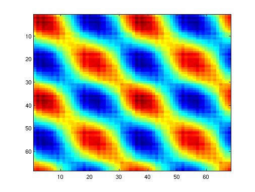
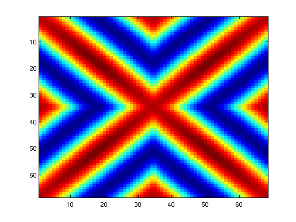
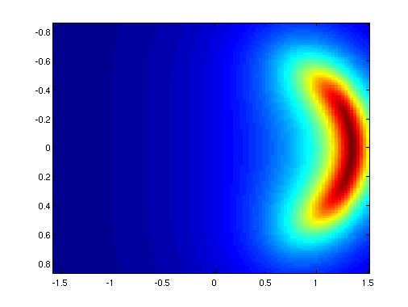
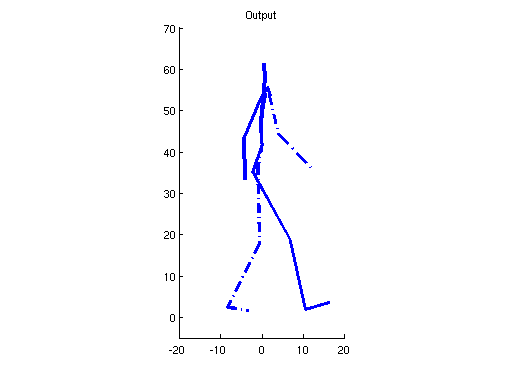
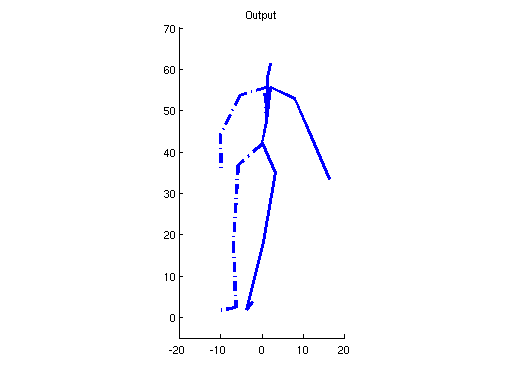
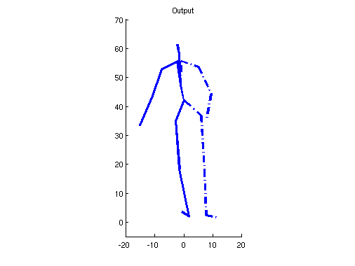
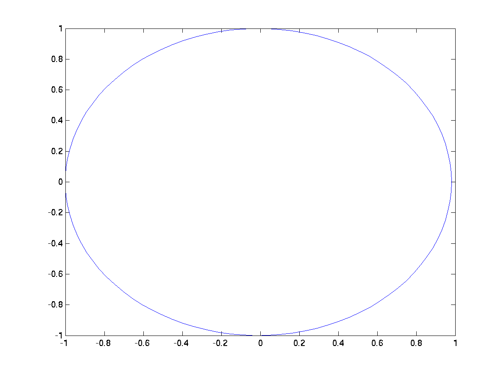
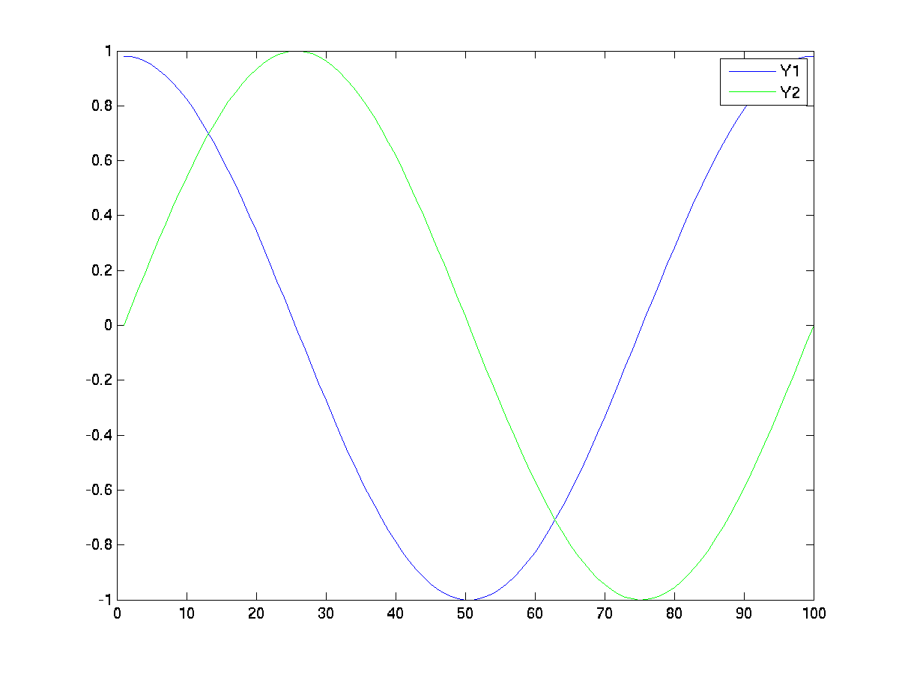
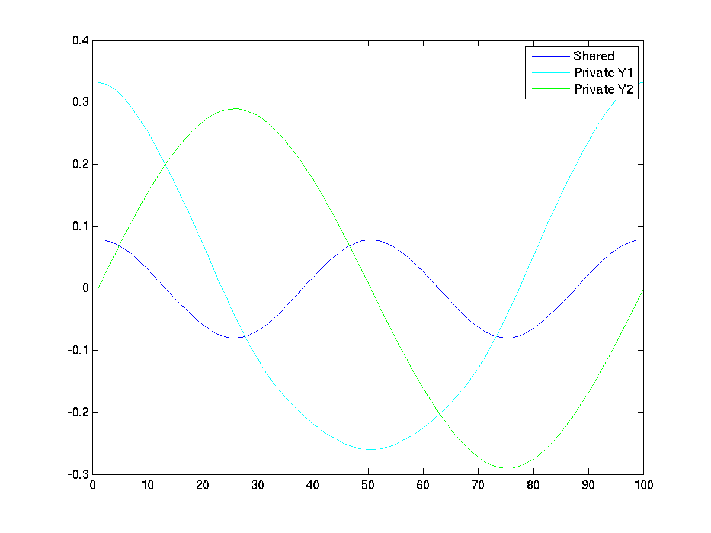

Shared GP-LVM Software
======================

This page describes examples of how to use the Gaussian process latent variable models with shared latent spaces (SGPLVM).


Release Information
-------------------

**Current release is 0.1**.

As well as downloading the SGPLVM software you need to obtain the toolboxes specified below. **These can be downloaded using the *same* password you get from registering for the SGPLVM software.**

|-----------------------------------------------|-------------|
| **Toolbox**                                   | **Version** |
| [NETLAB](/netlab/downloadFiles/vrs3p3)        | 3.3         |
| [PRIOR](/prior/downloadFiles/vrs0p22)         | 0.22        |
| [OPTIMI](/optimi/downloadFiles/vrs0p132)      | 0.132       |
| [DATASETS](/datasets/downloadFiles/vrs0p1371) | 0.1371      |
| [NDLUTIL](/ndlutil/downloadFiles/vrs0p162)    | 0.162       |
| [MOCAP](/mocap/downloadFiles/vrs0p136)        | 0.136       |
| [MLTOOLS](/mltools/downloadFiles/vrs0p135)    | 0.135       |
| [KERN](/kern/downloadFiles/vrs0p225)          | 0.225       |
| [GP](/gp/downloadFiles/vrs0p136)              | 0.136       |
| [FGPLVM](/fgplvm/downloadFiles/vrs0p163)      | 0.163       |
| [NCCA](/ncca/downloadFiles/vrs0p05)           | 0.05        |

Release Notes
-------------

### Current Release

Updated relese with FOLS model from AISTATS 2010 added.
#### Version 0.05

First release of software.
Examples
--------

### SGP-LVM

```matlab
>> demSgplvm
```

Demo script to create three different types of Shared GP-LVM models either using random data or a synthetic example of human motion.

```matlab
>> sgplvm_model_type = 'mlmi2008';
>> data_type = 'human';
```

The motion example was created by rotating a static pose around its own axis both counter-clockwise and clockwise but use the same descriptors which introduces ambiguities with respect to the heading direction in the view-plane. The SGP-LVM model created has a five dimensional latent space with two private directions for each observation space and a single shared direction. The model is initialised using the NCCA consolidation.



Kernel matrices to which NCCA consolidation is used to initialise the SGP-LVM model.



Unimodal silhouette.


 Bi-modal silhouette

### SGP-LVM FOLS

```matlab
>> dem_sgplvm_fols
```

Demo script that generates the toy example shown in Figure 1 in the paper Factorized Orthogonal Latent Spaces, Salzmann et. al. .



Observed data used for the example. Each observed space is the projection of the circle in the left most image onto each separate axis as shown in the right image.



The resulting embedding after learning a SGPLVM-FOLS model. The data is factorized into a single shared dimension and one single private dimension associated with each observed data space.

Page updated on Fri Jun 11 11:34:42 2010

